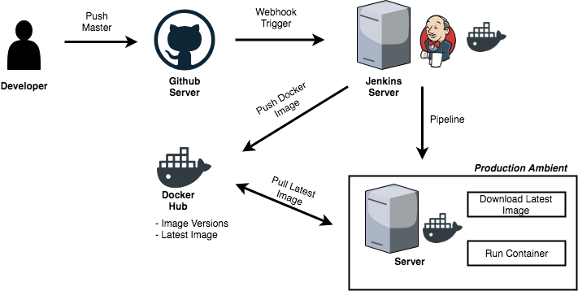
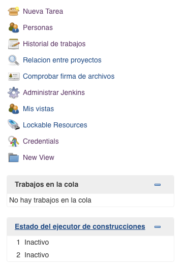

# Jenkins Integration With GitHub

Este es un proyecto con el cual podras ver como integrar Jenkins con un proyecto en Github, y hacer el despliegue de una infraestructura de desarrollo y una de produccion. El flujo de la informacion es el presentado en la siguiente imagen:



Como se puede observar en la imagen, lo que nosotros buscamos en este proyecto es que si un programador hace push a la rama Master o Dev (cualquier otra en especifico), jenkins sea capaz de levantar el contenedor que exponga los servicios de esas ramas e informe si ocurrio algun problema. Para eso este proyecto se dividio en dos repositorios:

* https://github.com/andres2508/docker-jenkins-CI.git
* https://github.com/andres2508/golang-jenkins-helloworld.git

El primer repositorio contiene la configuracion del servidor Jenkins y como preparar un `Job` para hacer integracion continua. Ademas de la configuracion del servidor de Jenkins, se presenta la configuracion del Docker Hub para el almacenamiento de las imagenes compiladas en la nube. En el segundo repositorio se encuentra toda la configuracion para compilar un micro-web framework basado en el lenguaje Go, y que sea desplegable desde una imagen de Docker. 

**NOTA IMPORTANTE**:

El unico requisito minimo para los dos proyectos es tener Docker instalado en las maquinas de desarrollo, en el servidor de produccion y en el servidor de integracion continua (servidor de Jenkins).

## Configuracion del Servidor Jenkins

Este repositorio contiene la configuracion de la imagen de Docker para levantar un servidor Jenkins con Docker instalado en el mismo contenedor. Los pasos para configurar el servidor de Jenkins son los siquientes:

1. **Correr el Contenedor**:
   
   El proyecto lo puedes correr con el siguiente comando:
   ```
   $ docker-compose up -d --build
   ```
   El servidor correra bajo la url `http://localhost:8080`. Todo el proceso de configuracion de credenciales se lleva directamente con el tutorial de Jenkins Getting Started.
   
   **NOTA IMPORTANTE**

   Ese comando corre el contenedor como un Daemon del sistema y el comando tiene que ser ejecutado en la carpeta principal del repositorio. Ademas, crea una copia de la carpeta de configuracion del servidor de Jenkins que se llama `jenkins_home`. Para parar el contenedor puedes utilizar el siguiente comando:
   
   ```
   $ docker-compose down
   ```
2. **Instalar Plugins**:
   
   Para realizar la integracion continua se requiere instalar unos determinados plugins. Para instalar un plugin ingresas a *Administrar Jenkins* y despues a *Administrar Plugins*, en esa pagina seleccionas el tab de `Todos los Plugins` para instalar los siguientes plugins:

   * GitHub Plugin
   * SSH Pipeline Steps

   Cuando los hayas seleccionado, presionas el boton de *Descargar e Instalar* y seleccionas la opcion de *Reiniciar Jenkins* para que los cambios sean efectivos.

3. **Creacion y Configuracion del Job**:
   
   El job es la tarea que sera encargada de ejecutar el *Deploy* de los ambientes de desarrollo y produccion. Para la configuracion del job se realizan los siguientes pasos:

   3.1. **Crear Job**:

   La primera parte de la creacion del Job es crear una nueva tarea.
   
   


Ten presente que es necesario instalalr en Jenkins el siguiente modulo: GitHub plugin, Generic Webhook Trigger